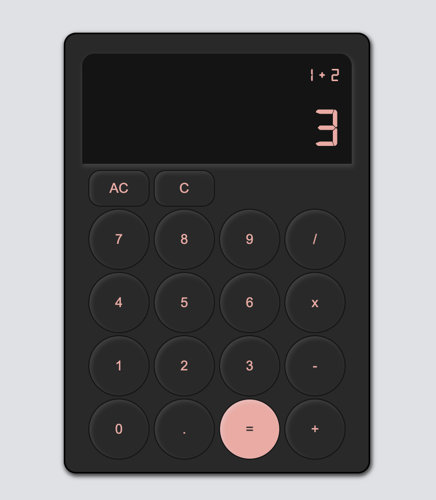

# calculator
Live preview can be found <a href="http://motokaneyuki.github.io/calculator">here</a>.

# Overview
This is a fully functional web-based calculator built as the final milestone for <a href="https://www.theodinproject.com/">The Odin Project’s</a> Foundations path. It was designed to handle everyday math and built to prevent errors and handle complex sequences without crashing.

Instead of just using basic math functions, I built a system that manages the calculation state in the background. This allows the calculator to remember your previous result while you start a new operation, just like a physical calculator would.

# How to use
### Basic Math
Click any numbers followed by an operator and the equals sign to get your result.

### Chaining Operations:
You don't have to hit equals every time. If you type 5 + 5 +, it will automatically calculate 10 and let you keep adding.

### Correcting Mistakes
Backspace (C): Click the backspace button to remove the last digit you typed if you made a mistake.

Clear (AC): Use the clear button to wipe everything and start a completely fresh calculation.

### Large Results 
If your answer is very long, the calculator will automatically round the decimals or switch to scientific notation so it doesn't run off the edge of the screen.

# Learning outcomes
As the final project for The Odin Project’s <a href="https://www.theodinproject.com/paths/foundations/courses/foundations">Foundations path</a>, this calculator shows everything I've learned so far in HTML, CSS, and JavaScript. 

I built it by keeping track of numbers and symbols behind the scenes so the calculator always knows what to do next. I also wrote special rules to stop common mistakes, like typing two decimals at once, being able to erase a digit from the answer, or breaking the app by dividing by zero. 

To keep the display clean, I added automatic rounding and scientific notation for huge results. I also made sure the calculator could chain multiple operations together and reset instantly with a clear button, making it feel smooth and easy to use.

# Future improvement plans
- Add keyboard support
- Add a button for positive/negative sign

# Attributions

Font by <a href="https://www.fontspace.com/digital-7-font-f7087">Style-7</a> from fontspace